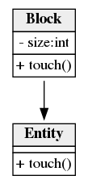
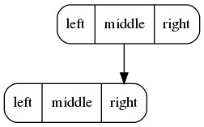

# graphp/graphviz [](https://travis-ci.org/graphp/graphviz)

GraphViz graph drawing for the mathematical graph/network library GraPHP.

The library supports visualizing graph images, including them into webpages,
opening up images from within CLI applications and exporting them
as PNG, JPEG or SVG file formats (among many others).
Because [graph drawing](http://en.wikipedia.org/wiki/Graph_drawing) is a complex area on its own,
the actual layouting of the graph is left up to the excelent [GraphViz](http://www.graphviz.org/)
"Graph Visualization Software" and we merely provide some convenient APIs to interface with GraphViz.

> Note: This project is in beta stage! Feel free to report any issues you encounter.

**Table of contents**

* [Quickstart examples](#quickstart-examples)
* [Attributes](#attributes)
  * [Graph attributes](#graph-attributes)
  * [Vertex attributes](#vertex-attributes)
  * [Edge attributes](#edge-attributes)
* [Labels](#labels)
  * [Vertex labels](#vertex-labels)
  * [Edge labels](#edge-labels)
  * [HTML-like labels](#html-like-labels)
  * [Record-based nodes](#record-based-nodes)
* [Install](#install)
* [Tests](#tests)
* [License](#license)

## Quickstart examples

Once [installed](#install), let's build and display a sample graph:

````php
$graph = new Graphp\Graph\Graph();

$blue = $graph->createVertex();
$blue->setAttribute('id', 'blue');
$blue->setAttribute('graphviz.color', 'blue');

$red = $graph->createVertex();
$red->setAttribute('id', 'red');
$red->setAttribute('graphviz.color', 'red');

$edge = $graph->createEdgeDirected($blue, $red);
$edge->setAttribute('graphviz.color', 'grey');

$graphviz = new Graphp\GraphViz\GraphViz();
$graphviz->display($graph);
````

The above code will open your default image viewer with the following image:


See also the [examples](examples/).

## Attributes

GraphViz supports a number of attributes on the graph instance itself, each
vertex instance (GraphViz calls these "nodes") and edge instance. Any of these
GraphViz attributes are supported by this library and have to be assigned using
GraPHP attributes as documented below.

For the full list of all GraphViz attributes, please refer to the
[GraphViz documentation](https://graphviz.gitlab.io/_pages/doc/info/attrs.html).

Note that all attributes use UTF-8 encoding (Unicode) and will be quoted and
escaped by default, so a `ö` and `>` will appear as-is and will not be
interpreted as HTML. See also [HTML-like labels](#html-like-labels) below for
more details.

### Graph attributes

GraphViz supports a number of attributes on the graph instance itself. Any of
these GraphViz attributes are supported by this library and have to be assigned
on the graph instance with the `graphviz.graph.` prefix like this:

```php
$graph = new Graphp\Graph\Graph();
$graph->setAttribute('graphviz.graph.bgcolor', 'transparent');
```

> Note how this uses the `graphviz.graph.` prefix and not just `graphviz.`. This
  is done for consistency reasons with respect to default vertex and edge
  attributes as documented below.

For example, the `rankdir` attribute can be used to change the orientation to
horizontal mode (left to right) like this:

```php
$graph = new Graphp\Graph\Graph();
$graph->setAttribute('graphviz.graph.rankdir', 'LR');

$hello = $graph->createVertex();
$hello->setAttribute('id', 'hello');
$world = $graph->createVertex();
$world->setAttribute('id', 'wörld');
$graph->createEdgeDirected($hello, $world);
```


See also the [examples](examples/).

Additionally, this library accepts an optional `graphviz.name` attribute that
will be used as the name (or ID) for the root graph object in the DOT output if
given. Unless explicitly assigned, this will be omitted by default. It is common
to assign a `G` here, but usually there should be no need to assign this. Among
others, this may be used as the title or tooltip in SVG output.

```php
$graph = new Graphp\Graph\Graph();
$graph->setAttribute('graphviz.name', 'G');

$graph->createVertex();
```

### Vertex attributes

GraphViz supports a number of attributes on each vertex instance (GraphViz calls
these "node" attributes). Any of these GraphViz attributes are supported by this
library and have to be assigned on the respective vertex instance with the
`graphviz.` prefix like this:

```php
$graph = new Graphp\Graph\Graph();

$blue = $graph->createVertex();
$blue->setAttribute('graphviz.color', 'blue');
```

Additionally, GraphViz also supports default attributes for all vertices. Any of
these GraphViz attributes are supported by this library and have to be assigned
on the graph instance with the `graphviz.node.` prefix like this:

```php
$graph = new Graphp\Graph\Graph();
$graph->setAttribute('graphviz.node.color', 'grey');

$grey = $graph->createVertex();
```

These default attributes can be overriden on each vertex instance by explicitly
assigning the same attribute on the respective vertex instance like this:

```php
$graph = new Graphp\Graph\Graph();
$graph->setAttribute('graphviz.node.color', 'grey');

$blue = $graph->createVertex();
$blue->setAttribute('graphviz.color', 'blue');
```

> Note how this uses the `graphviz.node.` prefix and not `graphviz.vertex.`. This
  is done for consistency reasons with respect to how GraphViz assigns these
  default attributes in its DOT output.

### Edge attributes

GraphViz supports a number of attributes on each edge instance. Any of these
GraphViz attributes are supported by this library and have to be assigned on the
respective edge instance with the `graphviz.` prefix like this:

```php
$graph = new Graphp\Graph\Graph();

$a = $graph->createVertex();
$b = $graph->createVertex();

$blue = $graph->createEdgeDirected($a, $b);
$blue->setAttribute('graphviz.color', 'blue');
```

Additionally, GraphViz also supports default attributes for all edges. Any of
these GraphViz attributes are supported by this library and have to be assigned
on the graph instance with the `graphviz.edge.` prefix like this:

```php
$graph = new Graphp\Graph\Graph();
$graph->setAttribute('graphviz.edge.color', 'grey');

$a = $graph->createVertex();
$b = $graph->createVertex();

$grey = $graph->createEdgeDirected($a, $b);
```

These default attributes can be overriden on each edge instance by explicitly
assigning the same attribute on the respective edge instance like this:

```php
$graph = new Graphp\Graph\Graph();
$graph->setAttribute('graphviz.edge.color', 'grey');

$a = $graph->createVertex();
$b = $graph->createVertex();

$blue = $graph->createEdgeDirected($a, $b);
$blue->setAttribute('graphviz.color', 'blue');
```

## Labels

### Vertex labels

By default, GraphViz will always render the vertex ID as the label.
If you do not assign an explicit `id` attribute to a vertex, this library will
automatically assign a vertex ID starting at `1` in the DOT output and GraphViz
will automatically render this vertex ID as the label. The following example
will automatically assign `1` and `2` as the label:

```php
$graph = new Graphp\Graph\Graph();

$v1 = $graph->createVertex();
$v2 = $graph->createVertex();
```

If you assign an `id` attribute to a vertex, this library will automatically
use it as the vertex ID in the DOT output and GraphViz will automatically render
this vertex ID as the label. The following example will automatically assign
`blue` as the label:

```php
$graph = new Graphp\Graph\Graph();

$a = $graph->createVertex();
$a->setAttribute('id', 'blue');
```

If you assign a `balance` attribute to a vertex, this library will automatically
include a `label` attribute that appends the balance value in parenthesis. The
following example will automatically assign `blue (+10)` as the label:

```php
$graph = new Graphp\Graph\Graph();

$blue = $graph->createVertex();
$blue->setAttribute('id', 'blue');
$blue->setAttribute('balance', 10);
```

You can use [vertex attributes](#vertex-attributes) to explicitly assign a
custom `label` attribute. Note that any balance value will still be appended
like in the previous example.

```php
$graph = new Graphp\Graph\Graph();

$blue = $graph->createVertex();
$blue->setAttribute('id', 'blue');
$blue->setAttribute('graphviz.label', 'Hello world!');
```

Note that all [attributes](#attributes) will be quoted and escaped by default,
so a `>` will appear as-is and will not be interpreted as HTML. See also
[HTML-like labels](#html-like-labels) below for more details.

Also note that you should either define *no* vertex IDs at all or *all* vertex
IDs. If you only define *some* vertex IDs, the automatic numbering may yield a
vertex ID that is already used explicitly and overwrite some of its settings.

### Edge labels

By default, GraphViz will not render any label on an edge:

```php
$graph = new Graphp\Graph\Graph();

$a = $graph->createVertex();
$b = $graph->createVertex();

$edge = $graph->createEdgeDirected($a, $b);
```

If you assign a `flow`, `capacity` or `weight` attribute to an edge, this library
will automatically include a `label` attribute that includes these values. The
following example will automatically assign `100` as the label for the weighted
edge:

```php
$graph = new Graphp\Graph\Graph();

$a = $graph->createVertex();
$b = $graph->createVertex();

$edge = $graph->createEdgeDirected($a, $b);
$edge->setAttribute('weight', 100);
```

The following example will automatically assign `4/10` as the label for an edge
with both flow and maximum capacity set:

```php
$graph = new Graphp\Graph\Graph();

$a = $graph->createVertex();
$b = $graph->createVertex();

$edge = $graph->createEdgeDirected($a, $b);
$edge->setAttribute('flow', 4);
$edge->setAttribute('capacity', 10);
```

The following example will automatically assign `4/∞/100` as the label for a
weighted edge with a flow and unlimited capacity:

```php
$graph = new Graphp\Graph\Graph();

$a = $graph->createVertex();
$b = $graph->createVertex();

$edge = $graph->createEdgeDirected($a, $b);
$edge->setAttribute('flow', 4);
$edge->setAttribute('capacity', null);
$edge->setAttribute('weight', 100);
```

You can use [edge attributes](#edge-attributes) to explicitly assign any
custom `label` attribute. Note that any flow, capacity or weight value will still
be appended like in the previous examples.

```php
$graph = new Graphp\Graph\Graph();

$a = $graph->createVertex();
$b = $graph->createVertex();

$edge = $graph->createEdgeDirected($a, $b);
$edge->setAttribute('graphviz.label', 'important');
```

### HTML-like labels

Note that all [attributes](#attributes) will be quoted and escaped by default,
so a `>` will appear as-is and will not be interpreted as HTML. GraphViz also
supports [HTML-like labels](https://graphviz.gitlab.io/_pages/doc/info/shapes.html#html)
that support a subset of HTML features.

GraphViz requires any HTML-like label to be wrapped in `<` and `>` and only
supports a limited subset of HTML features as documented above. In order to
prevent automatic quoting and escaping, all HTML-like attribute values need to
be passed with a trailing `_html` in the attribute name like this:

```php
$graph = new Graphp\Graph\Graph();

$a = $graph->createVertex();
$a->setAttribute('id', 'Entity');
$a->setAttribute('graphviz.shape', 'none');
$a->setAttribute('graphviz.label_html', '
<table cellspacing="0" border="0" cellborder="1">
    <tr><td bgcolor="#eeeeee"><b>\N</b></td></tr>
    <tr><td></td></tr>
    <tr><td>+ touch()</td></tr>
</table>');

$b = $graph->createVertex();
$graph->createEdgeDirected($b, $a);
$b->setAttribute('id', 'Block');
$b->setAttribute('graphviz.shape', 'none');
$b->setAttribute('graphviz.label_html', '
<table cellspacing="0" border="0" cellborder="1">
    <tr><td bgcolor="#eeeeee"><b>\N</b></td></tr>
    <tr><td>- size:int</td></tr>
    <tr><td>+ touch()</td></tr>
</table>');
```



See also the [examples](examples/).

### Record-based nodes

Note that all [attributes](#attributes) will be quoted and escaped by default,
so a `>` will appear as-is and will not be interpreted as HTML. Similar to the
above [HTML-like labels](#html-like-labels), GraphViz also supports simple
[record-based nodes](https://graphviz.gitlab.io/_pages/doc/info/shapes.html#record)
using the `record` and `Mrecord` shape attributes and structured label attributes.

GraphViz requires any record-based node label to be quoted, but uses special
syntax to mark record fields and optional port names. In order to prevent
automatic quoting and escaping, all record-based attribute values need to
be passed with a trailing `_record` in the attribute name like this:

```php
$graph = new Graphp\Graph\Graph();

$a = $graph->createVertex();
$a->setAttribute('graphviz.shape', 'Mrecord');
$a->setAttribute('graphviz.label_record', '<f0> left |<middle> middle |<f2> right'));

$b = $graph->createVertex();
$b->setAttribute('graphviz.shape', 'Mrecord');
$b->setAttribute('graphviz.label_record', '<f0> left |<f1> middle |<right> right'));

// a:middle -> b:right
$edge = $graph->createEdgeDirected($a, $b);
$edge->setAttribute('graphviz.tailport', 'middle');
$edge->setAttribute('graphviz.headport', 'right');
```



See also the [examples](examples/).

## Install

The recommended way to install this library is [through Composer](https://getcomposer.org).
[New to Composer?](https://getcomposer.org/doc/00-intro.md)

This will install the latest supported version:

```bash
$ composer require graphp/graphviz:^0.2.2
```

See also the [CHANGELOG](CHANGELOG.md) for details about version upgrades.

This project aims to run on any platform and thus does not require any PHP
extensions and supports running on legacy PHP 5.3 through current PHP 7+ and
HHVM.
It's *highly recommended to use PHP 7+* for this project.

The graph drawing feature is powered by the excellent [GraphViz](https://www.graphviz.org)
software. This means you'll have to install GraphViz (`dot` executable).
The [Graphviz homepage](https://www.graphviz.org/download/) includes complete
installation instructions for most common platforms, users of Debian/Ubuntu-based
distributions may simply invoke:

```bash
$ sudo apt install graphviz
```

## Tests

To run the test suite, you first need to clone this repo and then install all
dependencies [through Composer](https://getcomposer.org):

```bash
$ composer install
```

To run the test suite, go to the project root and run:

```bash
$ php vendor/bin/phpunit
```

## License

Released under the terms of the permissive [MIT license](http://opensource.org/licenses/MIT).
